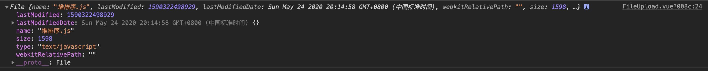
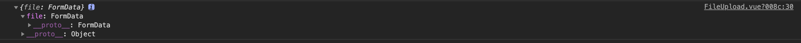

# 文件上传与下载

> 简介：本文主要介绍文件上传与下载的几种方式
>
> 本文作者：[SherwinShen](https://github.com/MrEnvision)   创建日期：2020-08-02
>
> 参考资料：[文件上传下载那些事](https://juejin.im/post/6844904142251507720) [前端文件下载通识篇](https://juejin.im/post/6844903700704526343) [纯JS生成并下载各种文本文件或图片](https://juejin.im/post/6844903699496566792)


## 1. 文件上传

### 1.1 Form 表单提交

> 直接通过 form 表单提交，也不需要 JS，action 即为接口地址，注意两点，一是类型需要设置为`multipart/form-data`，二是 input必须设置 name 属性，否则数据无法发送；

```html
<form method="post" action="接口地址" enctype="multipart/form-data">
  选择文件:<input type="file" name="file" />
  <button type="submit">提交</button>
</form>
```

### 1.2 文件接口上传

> 通过 document.getElementById('file').files[0] 获取 file 对象，再将其以 `formData` 形式发送请求；

```html
<input id="file" type="file" name="file" />
<button onclick="submitFile()">提交</button>

<script>
  submitFile() {
    const file = document.getElementById('file2').files[0]
    const formData = new FormData()
    formData.append('file', file)
    const data = {
      file: formData
    }
    // 将 data 通过 axios、fetch、ajax 等发送即可
    console.log(data)
  }
</script>
```

file 打印出来如下所示：



formData 打印出来如下所示：

> 打印出来是一个空的Objet，但并不是说它的内容是空的，只是它对前端开发人员是透明的，无法查看、修改、删除里面的内容



FormData无法得到文件的内容，但可以使用**FileReader**可以读取整个文件的内容

```js
const fileReader = new FileReader()
fileReader.onload = function(event) {
  console.log(event.target.result)
}
fileReader.readAsDataURL(file); // 按base64的方式读取，结果是base64，任何文件都可转成base64的形式
fileReader.readAsArrayBuffer(file); // 以原始二进制方式读取，读取结果可直接转成整数数组
```

注意，如果不以 FormData 传输，接口支持 base64 传输，就需要上述 FileReader 读取来转换。

### 1.3 分片上传

分片上传思路：

1. 将文件按一定大小(比如 1M)截取成一小份，并将切片带上 hash 值，用于作为标识，简单方式是文件名字+下标来标识，但是文件名修改就失去意义了，因此建议根据文件内容生成 `hash`，采用 `spark-md5` 库。
2. 将每个切片文件，当前端获取到本地图片后，利用 `Blob.prototype.slice` 方法（和数组的 `slice` 方法相似），将大文件按照一定大小（例如 1M）进行切割，再并发将各个分片上传到服务端，服务端保存每个切片文件的信息。
3. 切片上传完成后，服务端根据文件标识进行合并，合并完后删除切片文件。

断点续传思路：

1. 每个分片上传的时候，服务端记录上传好的文件 hash 值，上传成功后返回 hash 值给前端，前端记录 hash 值
2. 重新上传时，将每个文件的 hash 值与记录的 hash 值做比对，如果相同的话则跳过，继续下一个分段的上传。
3. 全部分片上传完成后，服务端根据文件标识进行合并，合并完后删除小文件。

```js
function chunkUpload() {
  // 切片处理
  let chunkSize = 1024 * 1024
  let totalSize = file.size
  let count = Math.ceil(totalSize / chunkSize)
  let chunkArr = []
  for (let i = 0; i < count; i++) {
    if (i === count.length - 1) {
      chunkArr.push(file.slice(i * chunkSize, totalSize))
    } else {
      chunkArr.push(file.slice(i * chunkSize, (i + 1) * chunkSize))
    }
  }
  // 上传处理
  for (let index = 0; index < count; index++) {
    uploadChunk(chunkArr[index]) // 上传过程中记得要计算MD等信息一起上传
  }
}
```


## 2. 文件下载

### 2.1 window.open

>浏览器可直接浏览的文件类型是不提供下载的，如 txt、png、jpg、gif 等，也无法知道下载的进度；

```html
<button @click="download1">下载1</button>
<script>
  download1() {
    window.open(downloadURL)
  }
</script>
```

### 2.2 调用 form 表单的 submit

> 同样无法知道下载的进度，无法直接下载浏览器可直接预览的文件类型；

```html
<button @click="download2">下载2</button>
<script>
  download2() {
    const form = document.createElement('form');
    form.method = 'get';
    form.action = downloadURL;
    //form.action = wordURL;
    //form.target = '_blank';	// form新开页面
    document.body.appendChild(form); // form 表单做出提交操作要先加入到 dom 树中
    form.submit();
    document.body.removeChild(form);
  }
</script>
```

### 2.3 调用 a 标签的 click

```html
<button @click="download3">下载3</button>
<script>
  download3() {
    const a = document.createElement('a');
    a.href = downloadURL;
    a.download = 'fileName.jpg' // download 对应下载文件名，并且如果没有download属性则也会直接在浏览器预览，而不会下载
    a.click();
  }
</script>
```

注意，2.3、2.2、2.1 还可以通过 ajax 请求后端，后端返回的是一个文件地址而不是文件流，然后利用该地址来请求下载即可。

### 2.4 Blob对象下载

> 除了利用已知文件地址路径进行下载，还能够发送请求 api 获取文件流进行下载，利用 Blob 对象可以将文件流转化成 Blob 二进制对象。基本思路：发请求获取二进制数据，转化为 Blob 对象，利用 URL.createObjectUrl 生成 url 地址，赋值在 a 标签的 href 属性上，结合 download 进行下载。 文件流 ->   fileReader转Blob对象 -> a标签下载

```html
<input id="file" type="file" name="file"/>
<button @click="download4">下载4</button>

<script>
  // 注意，这边通过 FileReader 来模拟后台返回的二进制文件流
  download4() {
    // 通过 FileReader 来生成二进制文件流
    const file = document.getElementById('file').files[0]
    const fileReader = new FileReader()
    fileReader.onload = function (event) {
      // event.target.result 为二进制文件流，然后处理下载
      const blob = new Blob([event.target.result]);
      const url = URL.createObjectURL(blob);
      const a = document.createElement('a');
      a.href = url;
      a.download = 'myFile.js'; // 也可以这么写 a.setAttribute('download', fileName);
      document.body.appendChild(a);
      a.click();
      document.body.removeChild(a);
    }
    fileReader.readAsArrayBuffer(file);
  }
</script>
```

### 2.5 Base64 下载

> base64可以实现任意类型文件的下载。文件流 -> fileReader转base64 -> a标签下载。

```js
// 文件转base64
function base64(文件流) {
  const file = new FileReader()
  fileReader.onload = function (event) {
    // 然后利用a标签点击下载同2.4
    const a = document.createElement('a');
    a.setAttribute('href', event.target.result); // 区别于2.4不需要转化
    a.download = 'myFile.js';
    document.body.appendChild(a);
    a.click();
    document.body.removeChild(a);
  }
  fileReader.readAsDataURL(file);
}
```

### 2.4 依赖其他库

通过第三方依赖包来实现，例如 [download 模块](https://npm.taobao.org/package/download) [file-saver](https://developer.aliyun.com/mirror/npm/package/file-saver)


## 3. 对象说明

### 3.1 Blob 对象

> Blob 对象表示一个二进制文件的数据内容，比如一个图片文件的内容就可以通过 Blob 对象读写。

```js
const blob = new Blob(array [, type]);

// 举例
const blob_1 = new Blob(['<a id="a"><b id="b">hey!</b></a>'], {type : 'text/html'});
const blob_2 = new Blob([ JSON.stringify({ hello: 'world' }) ], {type : 'application/json'});
```

第一个参数是数组，成员是字符串或二进制对象，表示新生成的`Blob`实例对象的内容；第二个参数是配置对象，目前只有一个属性`type`，表示数据的 MIME 类型。

**Blob 对象的属性与方法**

myBlob.size 获取大小，myBlob.type 获取文件类型，如"text/html"，Blob 对象有一个非常重要的方法 slice 用来拷贝原来的数据，`myBlob.slice(start, end, contentType)` 常用于大文件分片上传，详见[分片上传](#13 分片上传)

**生成URL**

浏览器允许使用`URL.createObjectURL()`方法，针对 Blob 对象生成一个临时 URL，以便于某些 API 使用。

```js
// 举例
img.src = URL.createObjectURL(files[i]);
a.href = URL.createObjectURL(files[i]);
```

注意，获取 Blob 对象后，直接打印是获取不到的，我们需要通过`FileReader`对象，读取 Blob 对象的内容，即文件内容。

```js
const reader = new FileReader();
reader.readAsText(blob); // 返回文本，需要指定文本编码，默认为 UTF-8。
reader.onload = function () {
  const text = reader.result; // 通过指定 FileReader 实例对象的onload监听函数，在实例的result属性上才拿到文件内容
}
```

### 3.2 File对象

> File 对象代表一个文件，用来读写文件信息。它继承了 Blob 对象，或者说是一种特殊的 Blob 对象，所有可以使用 Blob 对象的场合都可以使用它。最常见的使用场合是表单的文件上传控件（`<input type="file">`），用户选中文件以后，浏览器就会生成一个数组，里面是每一个用户选中的文件，它们都是 File 实例对象。

```js
const file = new File(array, name [, options])

// 举例
var file = new File(['foo'], 'foo.txt', { type: 'text/plain', });
```

第一个参数是数组，成员可以是二进制对象或字符串，表示文件的内容；第二个参数表示文件名或文件路径；第三个参数是可选对象，设置实例的属性。

### 3.3 FileReader对象

> FileReader 对象用于读取 File 对象或 Blob 对象所包含的文件内容。

最基础使用：

```j s
// HTML 代码如下
// <input type="file" onchange="onChange(event)">

function onChange(event) {
  var file = event.target.files[0];
  var reader = new FileReader();
  reader.onload = function (event) {
    console.log(event.target.result)
  };

  reader.readAsText(file);
}
```

- `FileReader.readAsText()`：返回文本，需要指定文本编码，默认为 UTF-8。
- `FileReader.readAsArrayBuffer()`：返回 ArrayBuffer 对象。
- `FileReader.readAsDataURL()`：返回 Data URL。
- `FileReader.readAsBinaryString()`：返回原始的二进制字符串。

## 4. 总结

**文件上传**（input 标签通过 document.getElementById('file').files[0] 获取 file 对象）：

- formData上传

```javascript
const file = document.getElementById('file2').files[0]
const formData = new FormData()
formData.append('file', file)
const data = { file: formData } // 发送 data
```

- Base64 通过字符串上传

```javascript
// 文件转 base64 以字符串上传即可 
const fileReader = new FileReader()
fileReader.onload = function(event) {
  const data = { file: event.target.result } // 发送 data
}
fileReader.readAsDataURL(file); // 按base64的方式读取，结果是base64，任何文件都可转成base64的形式
fileReader.readAsArrayBuffer(file); // 以原始二进制方式读取，读取结果可直接转成整数数组
```

✍️ FileReader 对象用于读取 File 对象或 Blob 对象所包含的文件内容。

大文件上传通过 FileReader 将 file 对象转成二进制数组，再通过 new Blob 生成 blob 对象，blob 对象

**文件下载**

- 调用 window.open(URL)
- 表单 form.action = URL 调用 submit()

```javascript
const form = document.createElement('form');
form.method = 'get';
form.action = downloadURL;
document.body.appendChild(form); 
form.submit();
document.body.removeChild(form);
```

- a 标签 href = URL 调用 click()

```javascript
const a = document.createElement('a');
a.href = downloadURL;
a.download = 'fileName.jpg'
a.click();
```

✍️ 没有URL则需要创造URL。数据（例如文件流、json等）可以转成 Blob 对象，再通过 URL.createObjectURL(blob) 即可获得 URL。

```javascript
const blob = new Blob([数据], options: { type: 类型 });
const url = URL.createObjectURL(blob);
```

✍️ base64 可以直接当成 URL 来下载。

------

如果发现本项目有内容上的错误，欢迎提交 issues 进行指正，相关合作请邮件<a href="mailto:EnvisionShen@gmail.com">EnvisionShen@gmail.com</a>联系