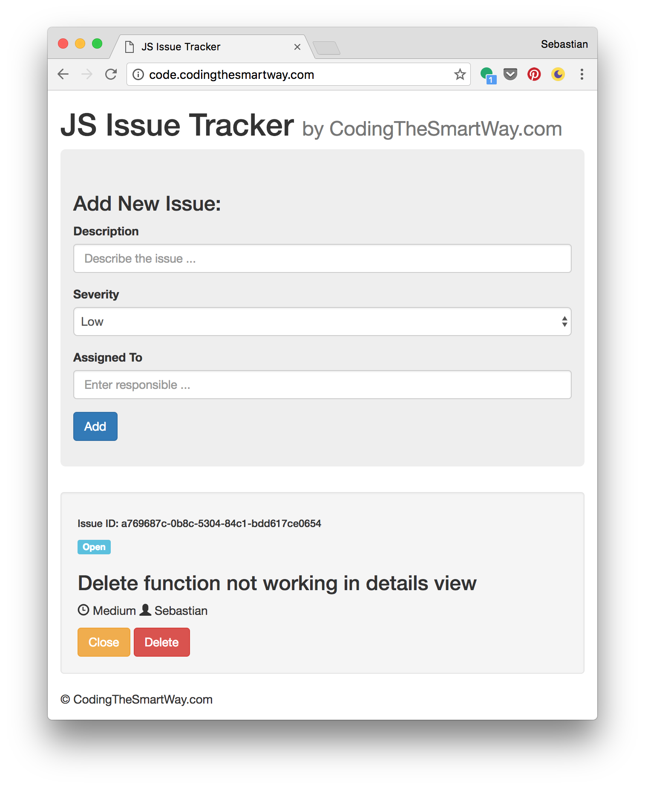

# PureJavaScript

> 简介： 纯 JavaScript 不借助框架库完成 issue tracker application，参考链接：[Pure JavaScript — Building A Real-World Application From Scratch](https://medium.com/codingthesmartway-com-blog/pure-javascript-building-a-real-world-application-from-scratch-5213591cfcd6)。

------

项目内容有错误或存在侵权，请提交 issues 进行指正，合作请邮件 <a href="mailto:EnvisionShen@gmail.com">EnvisionShen@gmail.com </a>联系。