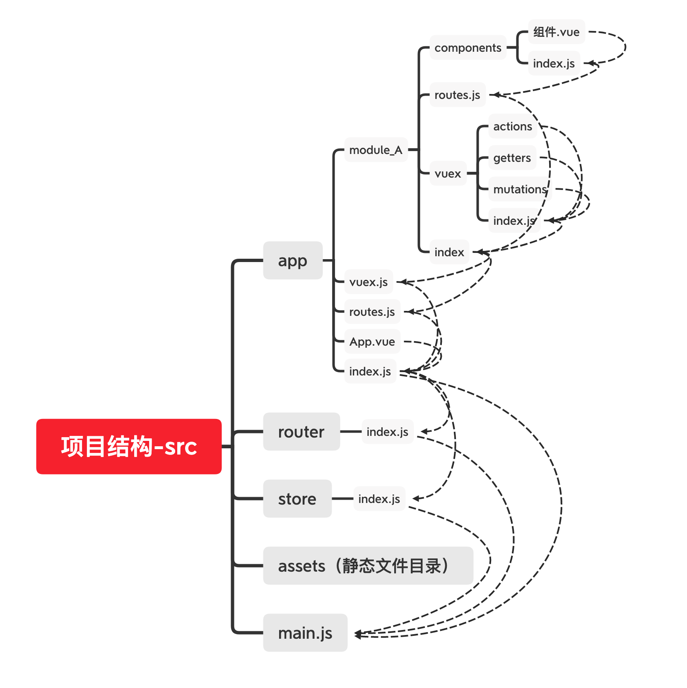

# vue项目结构

> 简介：一种vue项目的目录结构介绍，区别于vue-cli生成的目录
>
> 本文作者：[EnvisionShen](https://github.com/MrEnvision)
>
> 创建日期：2020-03-30
>
> 参考教程：[Structuring Very Large Applications](https://forum.vuejs.org/t/structuring-very-large-applications/840)


## 结构说明

```
.
├── src  // 主目录
│   ├── app // app目录
│   │   ├── App.vue 
│   │   ├── moduleA
│   │   │   ├── components // moduleA的组件
│   │   │   ├── vuex // moduleA的状态管理配置
│   │   │   ├── routes.js // moduleA的路由配置
│   │   │   └── index.js  // 导出routes对象和vuex对象
│   │   ├── index.js // 导出routes、vuex和app
│   │   ├── routes.js // 汇总module中的路由对象并导出
│   │   └── vuex.js // 汇总module中的状态管理对象并导出
│   ├── assets // 静态文件目录
│   │   └── logo.png 
│   ├── main.js 
│   ├── router // 路由目录
│   │   └── index.js // 引入vue-router
│   └── store // 状态管理目录
│       └── index.js // 引入vuex
```


- main.js - 引入vue-router和vuex

```javascript
import {App} from './app'
import router from './router';
import store from './store';

new Vue({
  el: '#app',
  router,
  store,
  components: { App },
  template: '<App/>'
})
```

- store/index.js - 引入vuex

```javascript
import Vue from 'vue';
import Vuex from 'vuex';
import {vuex} from '../app';

Vue.use(Vuex);

export default new Vuex.Store({
  modules: vuex
});
```

- router/index.js - 引入vue-router

```javascript
import Vue from 'vue'
import Router from 'vue-router'
import { routes } from '../app';

Vue.use(Router)

export default new Router({
  routes: routes
})
```

- app/index - 导出app中的vuex对象、路由对象和app

```javascript
export { default as routes } from './routes';
export { default as vuex } from './vuex';
export { default as App } from './App';
```

- app/vuex.js - 汇总所有module中的状态管理对象并导出

```javascript
import { vuex as moduleA } from './module_A';

export default { moduleA };
```

- app/routes.js - 汇总所有module中的路由对象并导出

```javascript
import { routes as moduleA } from './module_A';

export default [ ...moduleA ];
```

- app/module_A/index.js - 导出模块A的路由和状态管理

```javascript
export { default as routes } from './routes';
export { default as vuex } from './vuex';
```

- app/module_A/routes.js - 引入模块A的组件并设置路由

```javascript
import * as components from './components';

export default [
  {
    path: '/',
    component: components.HelloWorld,
    name: 'helloWorld'
  }
];
```

- app/module_A/components/index.js - 导出模块A的组件

```javascript
export { default as HelloWorld } from './HelloWorld';
```

- app/module_A/components/vuex/index.js - 导出模块A的状态管理操作

```javascript
import actions from './actions';
import mutations from './mutations';
import getters from './getters';

const state = {
  // 状态管理的数据写在这里
};

export default {
  state,
  actions,
  mutations,
  getters
};
```




------

如果发现本项目有内容上的错误，欢迎提交 issues 进行指正，相关合作请邮件<a href="mailto:EnvisionShen@gmail.com">EnvisionShen@gmail.com</a>联系